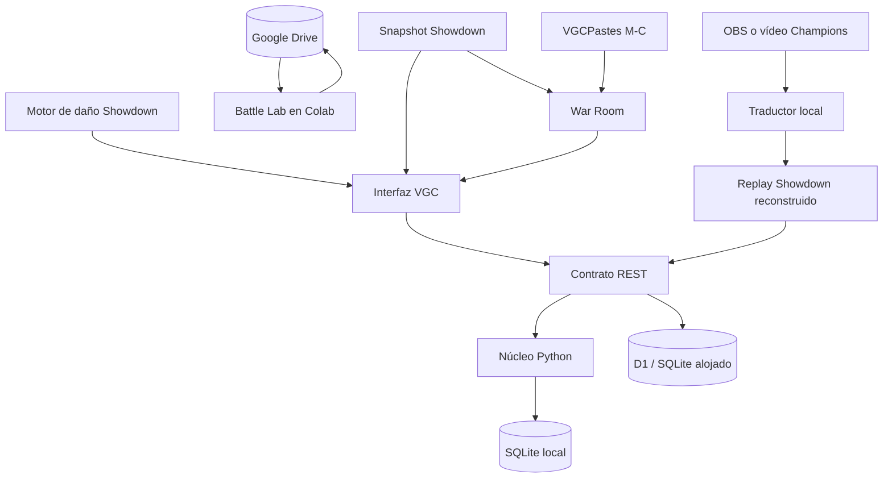

# Arquitectura del MVP

## Objetivo

Aplicación personal para guardar equipos VGC, conservar sus versiones, comparar
rendimiento histórico, simular daño entre dos sets y convertir evidencia
competitiva en planes auditables. No calcula probabilidades de victoria ni
modifica un Team automáticamente.

## Componentes

- `app/` y `components/vgc/`: interfaz React/Vinext y adaptador alojado.
- `backend/pkmn_vgc/`: parser, reglas de dominio, API FastAPI y repositorio
  SQLite para ejecución personal/autoalojada.
- `db/` y `drizzle/`: esquema y migraciones del adaptador D1, compatible con
  SQLite.
- `lib/`: contrato común de datos, estadísticas descriptivas y análisis de
  tipos.
- `vendor/smogon-calc/`: compilación reproducible del motor oficial de daño de
  Pokémon Showdown, fijada a un commit con soporte de Pokémon Champions.
- `public/data/showdown-dex.json.gz`: snapshot reproducible y comprimido de especies, stats,
  habilidades, movimientos, learnsets y objetos disponibles de Champions/VGC.
- `lib/war-room.ts`: motor determinista de legalidad, amenazas, selección de
  cuatro, leads y propuestas de optimización. Distingue set exacto, team preview
  y corpus, y expone índices de ordenación que no son win rates. Los pastes
  privados enriquecen el selector de rivales, pero no alteran las frecuencias
  calculadas desde el archivo público.
- `scripts/update-showdown-data.mjs`: generador del snapshot desde las tablas
  públicas oficiales de Pokémon Showdown.
- `battle_lab/` y `colab/`: runner reproducible y notebooks del Battle Lab. El
  motor Showdown escucha únicamente en loopback dentro de Colab; Google Drive
  persiste equipos, resultados, replays y checkpoints, mientras Gradio será la
  única superficie web temporal en las fases interactivas.
- `backend/pkmn_vgc/champions_replay/`: compañero local que obtiene frames de
  vídeo u OBS mediante FFmpeg, los lee con RapidOCR/ONNX Runtime, normaliza las
  observaciones y genera un documento de replay Showdown. La fuente live usa un
  buffer del último frame para no acumular atraso. El sitio sólo recibe el
  replay terminado; la captura no se ejecuta dentro de Cloudflare.

## Invariantes

1. Un equipo tiene una o más versiones.
2. Un cambio de especie o formato incrementa la versión mayor; un cambio de set
   incrementa la versión menor. Nunca se modifica la anterior.
3. Cada partida referencia una versión exacta mediante `team_version_id`.
4. Los resultados se recalculan desde partidas persistidas, no se escriben como
   métricas independientes.
5. El análisis de tipos separa la defensa base, la vista Tera y los efectos
   condicionales de habilidad/objeto.
6. Tipos y stats base son metadatos de especie de solo lectura; habilidades,
   movimientos y objetos se validan contra el snapshot del formato seleccionado.
7. Champions usa Stat Points (32 por stat, 66 totales) y su fórmula propia;
   Gen 6–9 conserva el modelo tradicional de EVs.
8. La calculadora trabaja con copias de los sets: sus ajustes no modifican el
   equipo ni crean una versión nueva.
9. Scouting conserva fuentes y observaciones; War Room es un módulo principal
   separado que produce recomendaciones trazables.
10. War Room nunca interpreta presencia en un Team público como uso en batalla,
    ni presenta frecuencias marginales de Battle Data como sets observados.
11. Toda propuesta se aplica primero a un borrador desechable de War Room, se
    revisa en Team Builder y se guarda como versión nueva; el motor no reescribe
    una versión existente.
12. Los bloqueos del optimizador son restricciones de dominio: cada propuesta
    conserva los campos protegidos antes de validar Item Clause, habilidad,
    naturaleza, Stat Points y cuatro movimientos legales sin duplicados.
13. Partner Search opera sobre un borrador desechable: cada integrante elegido
    conserva el slot, consume el lote visible y puede deshacerse sin tocar la
    versión persistida. Cada ronda reparte hasta cuatro alternativas por slot
    desbloqueado, con un máximo global de 20, y recalcula con el Team resultante.
14. Set Search comparte el historial reversible del borrador: aplica solamente
    los campos explícitamente propuestos y la tarjeta del integrante permite
    deshacer el último ajuste antes de enviar el Team completo al Builder.
15. Las altas de Partner Search prefieren un preset completo de Battle Data y
    caen a un set legal determinista si la fuente no responde. Cuando la muestra
    exacta/parcial se agota, la ronda se completa con candidatos nuevos del
    corpus global, etiquetados como búsqueda ampliada.
16. La comparación Original vs. Optimizado captura copias inmutables del
    borrador, conserva pool, lados y semillas de Team Preview entre candidatos,
    y separa el barrido de 40 rivales de la confirmación sobre los 10 matchups
    críticos del original. Un delta favorable solo se promueve como mejora
    confirmada cuando su IC95% queda completamente sobre cero.
17. La captura de Champions sólo persiste hechos visibles. Una partida con
    picks o eventos críticos ambiguos debe revisarse antes de alimentar las
    estadísticas de la versión del Team.

## Modelo inicial

| Tabla | Responsabilidad |
|---|---|
| `teams` | Identidad y nombre estable del equipo |
| `team_versions` | Paste inmutable, formato, mecánicas y versión mayor/menor |
| `pokemon_sets` | Los seis sets parseados de cada versión |
| `matches` | Resultado, replay, picks, leads, rival y notas |

## Próximos cortes

- Importador de replays de Showdown.
- Actualización programada del snapshot de Pokémon Showdown.
- Importación opcional de las hojas PASRS existentes.
- Adaptador universal Team Builder/VGCPastes y primera interfaz Gradio del
  Battle Lab.
