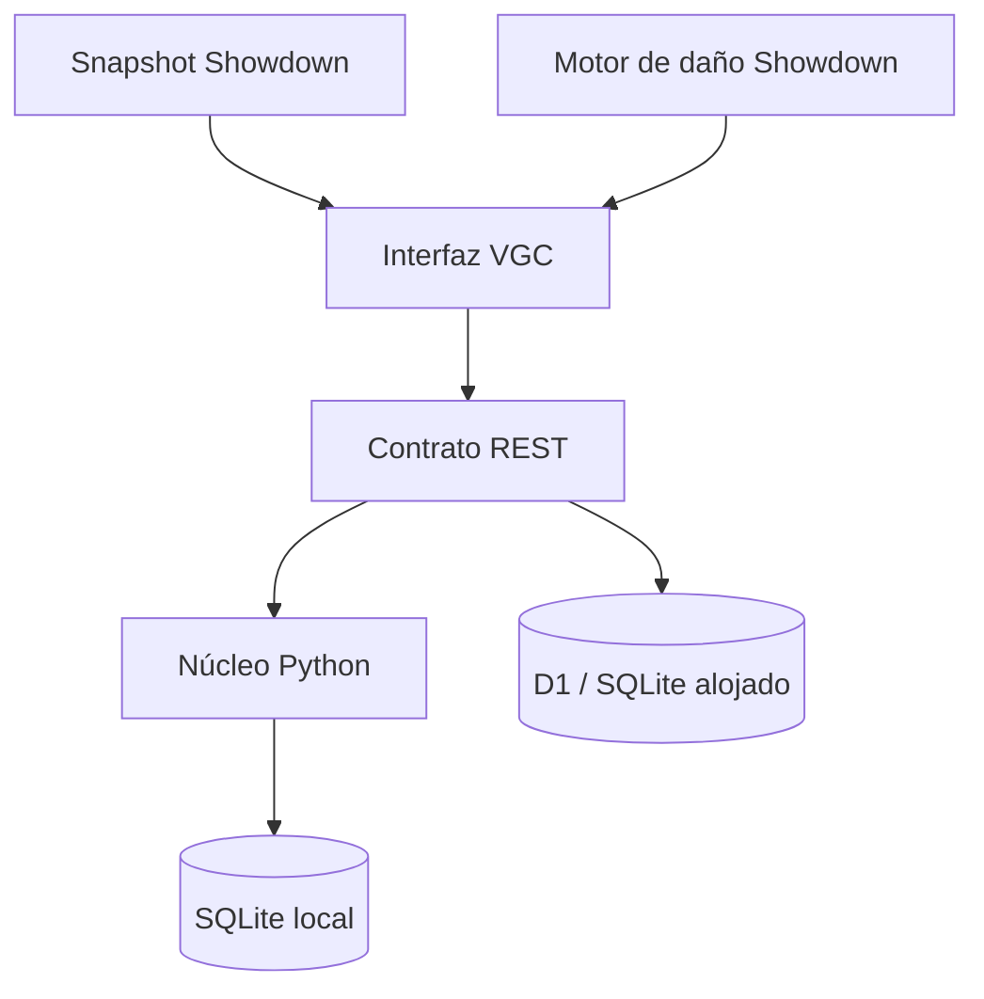

# Arquitectura del MVP

## Objetivo

Aplicación personal para guardar equipos VGC, conservar sus versiones, comparar
rendimiento histórico y simular daño entre dos sets. No hace predicciones ni
recomendaciones automáticas.

## Componentes

- `app/` y `components/vgc/`: interfaz React/Vinext y adaptador alojado.
- `backend/pkmn_vgc/`: parser, reglas de dominio, API FastAPI y repositorio
  SQLite para ejecución personal/autoalojada.
- `db/` y `drizzle/`: esquema y migraciones del adaptador D1, compatible con
  SQLite.
- `lib/`: contrato común de datos, estadísticas descriptivas y análisis de
  tipos.
- `vendor/smogon-calc/`: compilación reproducible del motor oficial de daño de
  Pokémon Showdown, fijada a un commit con soporte de Pokémon Champions.
- `public/data/showdown-dex.json.gz`: snapshot reproducible y comprimido de especies, stats,
  habilidades, movimientos, learnsets y objetos disponibles de Champions/VGC.
- `scripts/update-showdown-data.mjs`: generador del snapshot desde las tablas
  públicas oficiales de Pokémon Showdown.

## Invariantes

1. Un equipo tiene una o más versiones.
2. Un cambio de especie o formato incrementa la versión mayor; un cambio de set
   incrementa la versión menor. Nunca se modifica la anterior.
3. Cada partida referencia una versión exacta mediante `team_version_id`.
4. Los resultados se recalculan desde partidas persistidas, no se escriben como
   métricas independientes.
5. El análisis de tipos separa la defensa base, la vista Tera y los efectos
   condicionales de habilidad/objeto.
6. Tipos y stats base son metadatos de especie de solo lectura; habilidades,
   movimientos y objetos se validan contra el snapshot del formato seleccionado.
7. Champions usa Stat Points (32 por stat, 66 totales) y su fórmula propia;
   Gen 6–9 conserva el modelo tradicional de EVs.
8. La calculadora trabaja con copias de los sets: sus ajustes no modifican el
   equipo ni crean una versión nueva.

## Modelo inicial

| Tabla | Responsabilidad |
|---|---|
| `teams` | Identidad y nombre estable del equipo |
| `team_versions` | Paste inmutable, formato, mecánicas y versión mayor/menor |
| `pokemon_sets` | Los seis sets parseados de cada versión |
| `matches` | Resultado, replay, picks, leads, rival y notas |

## Próximos cortes

- Importador de replays de Showdown.
- Actualización programada del snapshot de Pokémon Showdown.
- Importación opcional de las hojas PASRS existentes.
