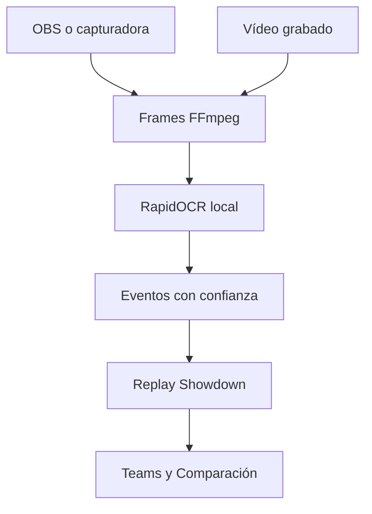

# Champions Replay

## Objetivo

Traducir una batalla nativa de Pokémon Champions, observada en vivo o desde un
vídeo, a un documento de replay compatible con el protocolo de Pokémon
Showdown. El traductor termina en ese documento; Teams/Comparación reutiliza su
importador existente para extraer resultado, Team Preview, picks, leads y
movimientos usados.



## Ruta implementada

- `ChampionsOcrDetector` usa RapidOCR y ONNX Runtime localmente. Lee el HUD y
  los mensajes en inglés, corrige errores comunes de HP, reconcilia nombres con
  el Pokédex incluido y produce eventos deterministas.
- `VideoFrameSource` procesa grabaciones a una frecuencia configurable. La
  entrada puede ser 60 FPS; no es necesario analizar los 60 frames de cada
  segundo.
- `LiveFrameSource` lee OBS Virtual Camera mediante FFmpeg y conserva sólo el
  frame más reciente. Si el OCR tarda, descarta imágenes viejas en vez de
  acumular retraso.
- `CaptureAccumulator` combina el Team conocido, Pokémon vistos y eventos, y
  elimina lecturas repetidas de un mismo mensaje visible en varios frames.
- El serializador produce tres artefactos equivalentes:
  - `.json`: contrato consumido por la aplicación;
  - `.log`: protocolo de batalla de Showdown;
  - `.html`: replay reproducible mediante el visor de Showdown.
- `OllamaVisionDetector` sigue disponible con `--detector ollama`, pero ya no es
  el detector por defecto.
- `--ocr-trace` guarda un JSONL por frame con texto, coordenadas, tiempo de OCR
  y eventos. El subcomando `trace` vuelve a aplicar el parser a ese archivo en
  segundos, sin repetir FFmpeg ni OCR.

Teams admite cargar el `.json` reconstruido desde **Replay Champions**. La
partida conserva origen Champions porque no se guarda una URL pública de
Showdown. Al guardar, Teams persiste el protocolo validado —no HTML
arbitrario— y el historial ofrece **Ver**, que genera el visor HTML interno y
lo abre en una pestaña nueva.

## Instalación en Windows

Requiere Python 3.12 o superior y FFmpeg disponible en `PATH`. Desde la raíz
del repositorio, usando el entorno ya creado:

```powershell
git switch desarrollo
git pull origin desarrollo
.\.venv-champions\Scripts\python.exe -m pip install -e ".\backend[dev,champions]"
.\.venv-champions\Scripts\champions-replay.exe --help
```

No hace falta activar el entorno ni cambiar la política de ejecución de
PowerShell. Los modelos pequeños de RapidOCR quedan instalados dentro del
entorno local.

Ollama es opcional. Sólo para comparar el fallback visual anterior:

```powershell
ollama pull qwen3-vl:4b
```

Las imágenes permanecen en la computadora: RapidOCR es local y el fallback de
Ollama rechaza endpoints remotos.

## Contexto conocido

Dar al detector el Team que se está probando reduce errores de nombres y
completa el Team Preview que no aparezca como texto durante el combate. El
archivo es opcional; todos los nombres del juego deben estar en inglés.

```json
{
  "players": {"p1": "IesYo", "p2": "Rival"},
  "teams": {
    "p1": ["Kleavor", "Pelipper", "Venusaur", "Sinistcha", "Archaludon", "Luxray"],
    "p2": []
  },
  "aliases": {
    "p1": {"Scizor Jr.": "Kleavor"},
    "p2": {}
  },
  "language": "en",
  "format": "gen9championsvgc2026regmc"
}
```

## Desde vídeo

Prueba corta con traza de diagnóstico:

```powershell
.\.venv-champions\Scripts\champions-replay.exe video ".\captures\champions-real-001.mp4" `
  --context ".\captures\champions-context.json" `
  --output ".\replays\champions-ocr-smoke" `
  --ocr-trace ".\replays\champions-ocr-smoke.trace.jsonl" `
  --max-frames 20 `
  --force
```

Ejecución completa:

```powershell
.\.venv-champions\Scripts\champions-replay.exe video ".\captures\champions-real-001.mp4" `
  --context ".\captures\champions-context.json" `
  --output ".\replays\champions-real-001" `
  --ocr-trace ".\replays\champions-real-001.trace.jsonl" `
  --force
```

El comando calcula con `ffprobe` cuántos frames analizará y muestra porcentaje,
tiempo transcurrido, ETA, eventos detectados y frames omitidos. Por defecto
analiza 2 FPS aunque el vídeo sea 60 FPS. Puede bajarse a `--sample-fps 1` en
una CPU lenta; subirlo aumenta sensibilidad y costo casi linealmente.

Una prueba con `--max-frames` puede terminar con “fuente sin batalla completa”:
eso es normal si esos primeros frames no incluyen el resultado. La traza sí se
conserva y permite revisar lo leído.

### Reprocesar una traza existente

Si el vídeo ya produjo `champions-real-001.trace.jsonl`, cualquier corrección
del parser o del archivo de contexto puede probarse sin analizar otra vez el
vídeo:

```powershell
.\.venv-champions\Scripts\champions-replay.exe trace ".\replays\champions-real-001.trace.jsonl" `
  --context ".\captures\champions-context.json" `
  --output ".\replays\champions-real-001-fixed" `
  --force
```

`aliases` traduce apodos visibles a especies canónicas. Es deliberadamente
explícito: el parser no adivina que un apodo parecido a una especie pertenece a
esa especie. Las formas también deben declararse con su nombre de Showdown, por
ejemplo `Indeedee-F`; el OCR puede leer `Indeedee`, pero el Team conocido
conserva automáticamente la forma correcta. Si el Team del rival lleva la
hembra, debe aparecer como `"Indeedee-F"` en `teams.p2`, no como `"Indeedee"`.

Las Mega Evolutions visibles generan tanto `detailschange` como `-mega` en el
protocolo de Showdown. Así, el replay cambia al sprite Mega y registra la
megapiedra en lugar de conservar esos textos como mensajes genéricos.

## En vivo con OBS Virtual Camera en Windows

Primero se puede confirmar el nombre exacto del dispositivo:

```powershell
ffmpeg -hide_banner -list_devices true -f dshow -i dummy
```

Después, iniciar la captura antes de comenzar la batalla:

```powershell
.\.venv-champions\Scripts\champions-replay.exe live "OBS Virtual Camera" `
  --backend dshow `
  --context ".\captures\champions-context.json" `
  --output ".\replays\champions-live" `
  --ocr-trace ".\replays\champions-live.trace.jsonl" `
  --force
```

También están disponibles `v4l2` para Linux, `avfoundation` para macOS y una
entrada `auto` para una URL o fuente que FFmpeg pueda abrir directamente.

## Contrato visual y límites actuales

Cada observación contiene timestamp, frame de origen y confianza. El detector
sólo declara hechos visibles: turnos, entradas al campo, movimientos
confirmados, HP, estados, KO, clima y resultado. Nunca rellena información
oculta por inferencia.

El OCR ya reconoce texto del HUD y mensajes; todavía no identifica los iconos
del Team Preview. Hasta implementar ese clasificador, conviene proporcionar el
Team propio en `--context`. Los Pokémon rivales se agregan cuando aparecen en
campo. Una captura se marca para revisión si no contiene seis Pokémon o cuatro
picks por lado, o si un evento crítico queda por debajo de 75% de confianza.

## Investigación previa

No se encontró una ingeniería inversa pública del logger original. Su
repositorio publica documentación y binarios con licencia propietaria. Los
proyectos públicos encontrados cubren partes aisladas —OCR de screenshots,
overlays o grabación—, pero no generan un battle log completo desde OBS. Por
eso esta implementación usa RapidOCR (Apache-2.0) y código propio para el
estado de batalla, sin copiar código sin licencia.

## Siguiente validación

La tubería, el contrato y el parser OCR tienen pruebas automatizadas y se
validaron contra screenshots públicos reales. La siguiente fuente de verdad es
la grabación real del usuario y su archivo `.trace.jsonl`; con esa traza toca:

1. ajustar zonas y frases que difieran en 1080p;
2. añadir el clasificador de iconos del Team Preview;
3. validar cambios, Mega Evolution, estados, clima, movimientos de área,
   multi-hit y daño residual;
4. medir precisión por tipo de evento antes de alimentar estadísticas sin
   revisión.

La fixture canónica vive en
`backend/tests/data/champions_capture.json`; su replay esperado es
`backend/tests/data/champions_replay.json` y también lo consume el parser
TypeScript del sitio.
