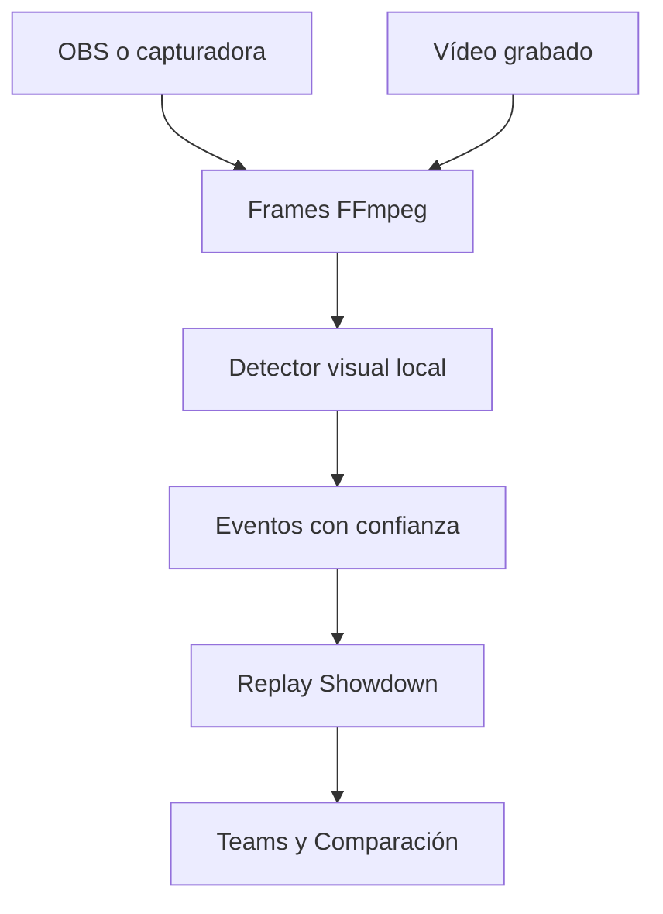

# Champions Replay

## Objetivo

Traducir una batalla nativa de Pokémon Champions, observada en vivo o desde un
vídeo, a un documento de replay compatible con el protocolo de Pokémon
Showdown. El traductor termina en ese documento; Teams/Comparación reutiliza su
importador existente para extraer resultado, Team Preview, picks, leads y
movimientos usados.



## Primer corte implementado

- `VideoFrameSource` y `LiveFrameSource` comparten la misma salida MJPEG y no
  dependen de OpenCV.
- `OllamaVisionDetector` consulta únicamente un servidor local y solicita JSON
  estructurado a `qwen3-vl:4b` por defecto.
- `CaptureAccumulator` combina Team Preview, selección y eventos, y elimina
  lecturas repetidas de un mismo mensaje visible en varios frames.
- El serializador produce tres artefactos equivalentes:
  - `.json`: contrato consumido por la aplicación;
  - `.log`: protocolo de batalla de Showdown;
  - `.html`: replay reproducible mediante el visor oficial de Showdown.
- Teams admite cargar el `.json` reconstruido desde **Replay Champions**. La
  partida conserva origen Champions porque no se guarda una URL pública de
  Showdown.

## Requisitos locales

- Python 3.12 o superior.
- FFmpeg disponible en `PATH`.
- [Ollama](https://ollama.com/) 0.12.7 o posterior ejecutándose localmente.
- Un modelo visual compatible:

```bash
ollama pull qwen3-vl:4b
pip install -e backend
```

El detector rechaza endpoints remotos deliberadamente: las imágenes del juego
permanecen en la computadora del usuario.

## Contexto conocido

Dar al detector el Team que se está probando reduce errores de nombres. El
archivo es opcional; el rival puede quedar vacío hasta leer el Team Preview.

```json
{
  "players": {"p1": "IesYo", "p2": "Rival"},
  "teams": {
    "p1": ["Kleavor", "Pelipper", "Venusaur", "Sinistcha", "Archaludon", "Luxray"],
    "p2": []
  },
  "language": "en",
  "format": "gen9championsvgc2026regmc"
}
```

## Desde vídeo

```bash
champions-replay video "batalla.mp4" \
  --context champions-context.json \
  --output replays/batalla-001
```

## En vivo con OBS Virtual Camera en Windows

```bash
champions-replay live "OBS Virtual Camera" \
  --backend dshow \
  --context champions-context.json \
  --output replays/batalla-live
```

También están disponibles `v4l2` para Linux, `avfoundation` para macOS y una
entrada `auto` para una URL o fuente que FFmpeg pueda abrir directamente.

## Contrato visual

Cada observación contiene timestamp, frame de origen y confianza. El detector
sólo puede declarar hechos visibles: turnos, entradas al campo, movimientos
confirmados, HP, estados, objetos/habilidades revelados, KO y resultado. Los
cuatro seleccionados deben ordenarse con los dos leads primero para generar el
`inputlog` de Showdown correctamente.

Una captura se marca para revisión cuando no contiene los cuatro picks de algún
lado o cuando un evento crítico queda por debajo de 75% de confianza. Nunca se
rellena información oculta por inferencia.

## Estado y siguiente validación

La tubería y el contrato están probados con un combate fixture de extremo a
extremo. Antes de considerar fiable el reconocimiento visual faltan:

1. calibrar el prompt y la frecuencia de muestreo con grabaciones reales del
   juego en inglés a 1080p/30fps;
2. añadir detección barata de escenas para enviar al modelo sólo frames con
   Team Preview, mensajes o resultados;
3. medir precisión por campo y preparar una revisión rápida de eventos dudosos;
4. validar batallas con cambios, Megaevolución, estados, clima, movimientos de
   área, multi-hit y daño residual.

La fixture canónica vive en
`backend/tests/data/champions_capture.json`; su replay esperado es
`backend/tests/data/champions_replay.json` y también lo consume el parser
TypeScript del sitio.
