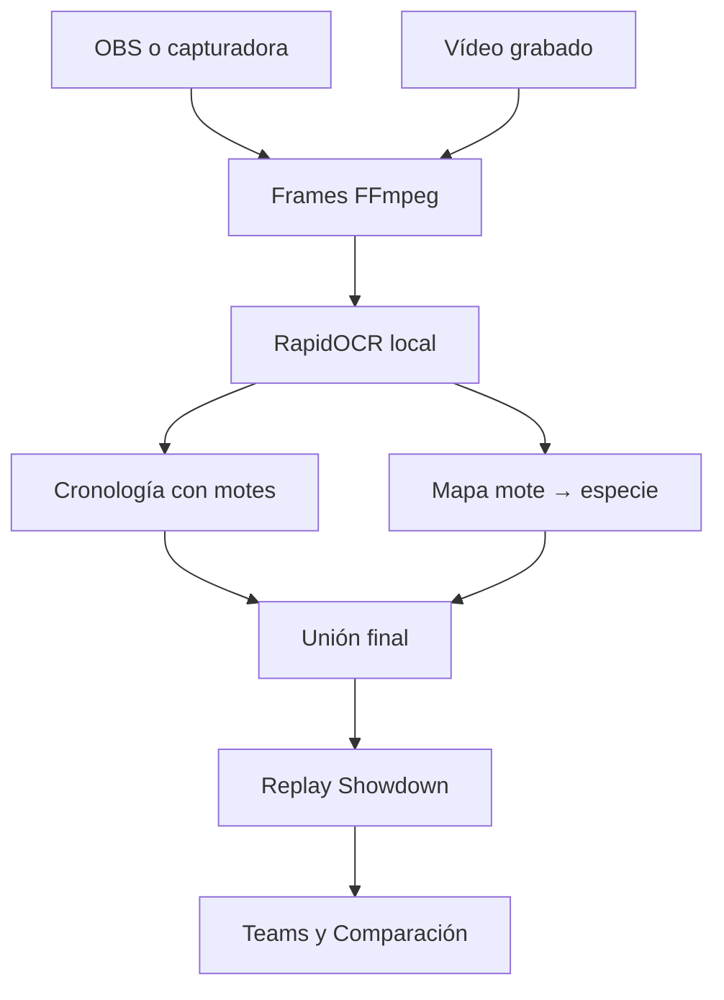

# Champions Replay

## Objetivo

Traducir una batalla nativa de Pokémon Champions, observada en vivo o desde un
vídeo, a un documento de replay compatible con el protocolo de Pokémon
Showdown. El traductor termina en ese documento; Teams/Comparación reutiliza su
importador existente para extraer resultado, Team Preview, picks, leads y
movimientos usados.


```mermaid
flowchart TD
    LIVE[OBS o capturadora] --> FRAMES[Frames FFmpeg]
    VIDEO[Vídeo grabado] --> FRAMES
    FRAMES --> OCR[RapidOCR local]
    OCR --> TIMELINE[Cronología con motes]
    OCR --> ALIASES[Mapa mote → especie]
    TIMELINE --> JOIN[Unión final]
    ALIASES --> JOIN
    JOIN --> REPLAY[Replay Showdown]
    REPLAY --> STATS[Teams y Comparación]
```

## Ruta implementada

### Motor web vigente: Champions Ledger (28 sep 2026)

La carga y reanálisis de vídeos de la aplicación usan ahora esta ruta:

1. Un recorrido OCR secuencial conserva `output/ocr.trace.jsonl`. La captura
   separa batallas y espera los aliases/Team Preview pendientes, sin pedir al
   ensamblador de COL-102 que apruebe o reconstruya una batalla.
2. `champions_replay/ledger_pipeline.py` ejecuta `BattleAutomaton` para cada
   índice original de batalla. Guarda `ledger-battle-NNN.json` y su cronología
   `.md`, incluidos los avisos y su evidencia.
3. El puente `prototype/ledger_replay.py` corrobora jugadores, equipos y
   ganador desde la misma traza y el contexto del job. Sólo emite el replay
   cuando ambos autómatas pasan; no consulta replays anteriores como verdad.
4. El documento canónico recibe `reconciliation_version: champions-ledger-v1`
   y conserva `ledger_source` y `source_battle_index`. El guardado de Teams
   vuelve a buscar ese documento en el job antes de derivar sus estadísticas.

`ledger-report.json` relaciona los índices originales con los números de
replay y detalla qué batallas están listas o bloqueadas. Una batalla bloqueada
no impide exportar las siguientes. Si ninguna pasa, el job termina en error
con su diagnóstico disponible; nunca recurre automáticamente al generador
anterior. No hay relectura densa automática.

**Descargar diagnóstico** conserva `job.json`, la traza, los Ledger JSON/MD,
el informe, los errores y los replays JSON/LOG/HTML. Incluye también las
corridas archivadas en `output/history/`; nunca incluye el vídeo. Antes de
reanálisis se archivan todos los archivos de la corrida actual. Para reproducir
un problema descargado se siguen usando los dos comandos independientes:

```bash
python backend/pkmn_vgc/champions_replay/prototype/champions_automaton.py --diagnostic champions-diagnostics-JOB.zip --out revision
python backend/pkmn_vgc/champions_replay/prototype/ledger_replay.py --ledger revision/battle-01.json --diagnostic champions-diagnostics-JOB.zip --out revision/replay
```

Los módulos anteriores se conservan como referencia: `pipeline.py`,
`showdown.py`, `reconcile.py` y `_legacy_processor` en `champions_jobs.py`.
La escritura de archivos y el visor de `showdown.py` siguen reutilizándose;
su ensamblador anterior ya no genera los replays del job web. Los subcomandos
históricos del CLI (`video`, `live`, `trace`, `events`, `verify`, `reconcile`)
siguen disponibles para investigación y comparación. Los replays guardados
de COL-102 r11/r12 mantienen su compatibilidad, sin atribuirles una corrida
de Ledger. La corrección de identidad Mega se aplica al importar partidas.

Tras actualizar `desarrollo`, reinicia `npm.cmd run dev` y el servicio Python
si lo ejecutas por separado. Los jobs ya terminados conservan sus salidas;
**Reanalizar vídeo** usa el motor nuevo sin volver a subir la grabación.

### Arquitectura anterior conservada como referencia

Los detalles siguientes describen la captura y ensamblado original de COL-102
y sus herramientas CLI. Para la generación web vigente aplica la ruta de
Ledger indicada arriba.

- `ChampionsOcrDetector` usa RapidOCR y ONNX Runtime localmente. Lee el HUD y
  los mensajes en inglés, corrige errores comunes de HP, reconcilia nombres con
  el Pokédex incluido y produce eventos deterministas.
- Cuando aparece un nickname desconocido, el parser conserva sus movimientos y
  combina cada nueva evidencia con los learnsets y habilidades legales del
  catálogo Champions. Sólo aprende el alias cuando queda una especie posible;
  entonces recupera también los movimientos que estaban pendientes. El Team
  rival conocido, las formas Mega y los aliases explícitos reducen candidatos,
  incluyendo formas con género como `Basculegion-F`.
- `VideoFrameSource` procesa grabaciones a una frecuencia configurable. La
  entrada puede ser 60 FPS; no es necesario analizar los 60 frames de cada
  segundo. Cada frame muestreado pasa una sola vez por RapidOCR y el parser lo
  consume secuencialmente para conservar slots, HP, aliases y turnos.
- Durante ese único recorrido, un carril guarda en memoria las observaciones
  OCR originales con timestamp y número de frame, mientras otro resuelve el
  mapa de nicknames por batalla y lado. Al detectar el resultado se aplica el
  mapa completo a la cronología; no se vuelve a leer el vídeo ni la traza.
- En el Team Preview, un worker independiente lee las placas de tipo y las
  siluetas de las seis filas rivales. Los tipos reducen el Pokédex a uno o dos
  candidatos y la silueta o el género resuelven los empates. El roster queda
  guardado en `ocr.trace.jsonl` y limita después la relación mote → especie.
  La primera lectura descarga únicamente los sprites ambiguos desde el catálogo
  propios de Pokémon Champions que viajan en `public/data/champions-sprites/`
  (se regeneran con `npm run data:champions-sprites`).
- `LiveFrameSource` lee OBS Virtual Camera mediante FFmpeg y conserva sólo el
  frame más reciente. Si el OCR tarda, descarta imágenes viejas en vez de
  acumular retraso.
- `CaptureAccumulator` combina el Team conocido, Pokémon vistos y eventos, y
  elimina lecturas repetidas de un mismo mensaje visible en varios frames.
- El serializador produce tres artefactos equivalentes:
  - `.json`: contrato consumido por la aplicación;
  - `.log`: protocolo de batalla de Showdown;
  - `.html`: replay reproducible mediante el visor de Showdown.
- `OllamaVisionDetector` completo sigue disponible con `--detector ollama`,
  únicamente como herramienta experimental de compatibilidad. El flujo OCR
  usado por vídeo, web y OBS no inicia Ollama ni carga un modelo generativo.
- `--ocr-trace` guarda un JSONL por frame con texto, coordenadas, tiempo de OCR
  y eventos. El subcomando `trace` vuelve a aplicar el parser a ese archivo en
  segundos, sin repetir FFmpeg ni OCR; es la misma segunda fase con la que el
  job web construye sus replays.

Teams admite cargar el `.json` reconstruido desde **Replay Champions**. La
partida conserva origen Champions porque no se guarda una URL pública de
Showdown. Al guardar, Teams persiste el protocolo validado —no HTML
arbitrario— y el historial ofrece **Ver**, que genera el visor HTML interno y
lo abre en una pestaña nueva.

## Carga web desde otra computadora

Al ejecutar `npm.cmd run dev` en la ROG, el sitio detecta
`.venv-champions` e inicia automáticamente el receptor local en
`127.0.0.1:8770`. Desde otra PC de la misma red se abre
`http://IP-DE-LA-ROG:5173`, se selecciona el Team y se pulsa **Vídeo Champions**.

La grabación se envía en fragmentos de 8 MiB. Si hay un fallo transitorio, cada
fragmento se reintenta; si se cierra la página durante la carga, seleccionar de
nuevo el mismo archivo continúa desde el último offset confirmado. El trabajo
queda en `data/champions-jobs` con estos estados:

1. **Recibiendo vídeo**;
2. **Esperando turno**;
3. **Analizando vídeo** con frames, ETA, eventos y batallas detectadas;
4. **Replays listos** o **Error**.

La cola procesa un vídeo a la vez para no saturar la ROG. Usa 2 FPS y ejecuta
el OCR de forma estrictamente secuencial para conservar el orden de los
acontecimientos. En ese mismo recorrido mantiene dos carriles lógicos: uno
registra los eventos con los motes visibles y el otro construye la relación
mote → especie. La sustitución se hace al cerrar cada batalla, sin una segunda
vuelta al vídeo.

El replay no sale de ese recorrido. Mientras se lee el vídeo, cada decisión se
toma con lo que se sabe hasta ese frame: el roster rival puede resolverse
recién al cerrar la batalla, y el HUD puede confirmar un slot muchos segundos
después del anuncio. Por eso el job trabaja en dos fases. La primera es el
único recorrido del vídeo y deja en `ocr.trace.jsonl` todo lo que necesita la
imagen (texto, sprites del Team Preview, motes del HUD, límites de cada
batalla). La segunda construye los replays desde esa traza ya completa, con el
roster rival y los motes finales de cada batalla conocidos desde su primer
frame. Tarda segundos y es exactamente lo que hace el subcomando `trace`.

En esa segunda fase cada texto del juego cuenta como un solo aviso aunque el
OCR lo relea con variantes durante varios frames ("Speed fell!", "Speed
fel!", o cortado mientras se borra). Las lecturas casi iguales de frames
seguidos se agrupan y el aviso se lee una vez, en su primer frame, con la
lectura cuyas palabras más se repiten en el resto de la traza
(`champions_replay/notices.py`).

La misma pasada previa guarda qué confirmó el HUD en cada frame
(`champions_replay/armado.py`). Con eso, cuando el juego anuncia una entrada
con dos slots libres ("sent out Pelipper!" tras un relevo y un debilitado), la
segunda fase mira dónde la confirma el HUD, sin pasar del turno siguiente, y
escribe el switch en el momento del anuncio en vez de esperar. En vivo, sin
futuro que mirar, sigue esperando. Lo narrado antes de que entren los líderes
se sigue escribiendo detrás de sus cuatro switches, que es el orden de
Showdown.

Un vídeo con varias batallas genera `replay-001.*`,
`replay-002.*`, etc. La versión seleccionada aporta el Team propio y sus alias,
mientras el rival se reconstruye desde lo visible. Cada resultado vuelve al
formulario de revisión y no entra al historial hasta que el usuario lo
confirma.

Las grabaciones móviles verticales se orientan a partir del HUD de Champions,
no del primer texto legible: una notificación del sistema o de WhatsApp no fija
la rotación del vídeo. Los overlays pasajeros y los falsos cierres sin una
batalla reconstruible se descartan y el análisis continúa. El Team Preview
4/6 se reconoce como una etapa propia: su contador no se confunde con HP, el
orden 1–4 se conserva y los nicknames propios se asocian con el Team conocido
por la posición de cada fila. Tanto **Reintentar análisis** tras un error como
**Reanalizar vídeo** sobre un resultado existente reutilizan el archivo
guardado en la ROG sin transferirlo nuevamente.

Antes de iniciar una reanalización, los replays, trazas y logs de la corrida
vigente se mueven a `output/history/<fecha>-<id>/`. **Descargar diagnóstico**
genera un ZIP con `job.json` y los artefactos de la corrida actual y las
anteriores, pero nunca incluye el vídeo original. Esto permite revisar una
regresión sin destruir la evidencia de intentos previos.

El servicio Python sólo escucha en loopback. La ruta web actúa como proxy de
lista blanca para que la otra PC nunca acceda directamente al proceso local.
La web de desarrollo no incluye autenticación LAN: debe usarse únicamente en
una red privada de confianza y permitirse en el Firewall de Windows sólo para
redes privadas.

## Instalación en Windows

Requiere Python 3.12 o superior y FFmpeg disponible en `PATH`. Desde la raíz
del repositorio, usando el entorno ya creado:

```powershell
git switch desarrollo
git pull origin desarrollo
.\.venv-champions\Scripts\python.exe -m pip install -e ".\backend[dev,champions]"
.\.venv-champions\Scripts\champions-replay.exe --help
```

No hace falta activar el entorno, cambiar la política de ejecución de
PowerShell ni instalar Ollama. Los modelos pequeños de RapidOCR quedan dentro
del entorno local; la reconstrucción y la inferencia de aliases no salen de la
computadora. La primera reanálisis con Team Preview puede llenar la caché local
de sprites de Showdown; los siguientes trabajos reutilizan esos archivos.

Para vídeos con motes japoneses hay un segundo lector opcional: el modelo
`PP-OCRv6_rec_medium.onnx` (73 MB, del repositorio de modelos de RapidOCR)
relee sólo las frases del juego en las que el modelo habitual ya vio japonés,
y se queda con su lectura cuando no pierde caracteres ni palabras. En el
vídeo de referencia actúa en el 4 % de los frames y suma un 10 % de tiempo.
No se descarga solo: si no está en `.venv-champions\Lib\site-packages\rapidocr\models`,
el análisis sigue como siempre con el modelo `small`. Para instalarlo:

```powershell
.\.venv-champions\Scripts\python.exe -c "from rapidocr import RapidOCR, ModelType; RapidOCR(params={'Rec.model_type': ModelType.MEDIUM})"
```

## Contexto conocido

Dar al detector el Team que se está probando reduce errores de nombres y
completa el Team Preview que no aparezca como texto durante el combate. El
archivo es opcional; todos los nombres del juego deben estar en inglés.

```json
{
  "players": {"p1": "IesYo", "p2": "Rival"},
  "teams": {
    "p1": ["Kleavor", "Pelipper", "Venusaur", "Sinistcha", "Archaludon", "Luxray"],
    "p2": []
  },
  "aliases": {
    "p1": {"Scizor Jr.": "Kleavor"},
    "p2": {}
  },
  "language": "en",
  "format": "gen9championsvgc2026regmc"
}
```

## Desde vídeo

Prueba corta con traza de diagnóstico:

```powershell
.\.venv-champions\Scripts\champions-replay.exe video ".\captures\champions-real-001.mp4" `
  --context ".\captures\champions-context.json" `
  --output ".\replays\champions-ocr-smoke" `
  --ocr-trace ".\replays\champions-ocr-smoke.trace.jsonl" `
  --max-frames 20 `
  --force
```

Ejecución completa:

```powershell
.\.venv-champions\Scripts\champions-replay.exe video ".\captures\champions-real-001.mp4" `
  --context ".\captures\champions-context.json" `
  --output ".\replays\champions-real-001" `
  --ocr-trace ".\replays\champions-real-001.trace.jsonl" `
  --force
```

El comando calcula con `ffprobe` cuántos frames analizará y muestra porcentaje,
tiempo transcurrido, ETA, batallas terminadas, eventos detectados y frames
omitidos. Por defecto analiza 2 FPS aunque el vídeo sea 60 FPS. Puede bajarse a
`--sample-fps 1` en una CPU lenta; subirlo aumenta sensibilidad y costo casi
linealmente. El OCR permanece secuencial porque el parser mantiene estado entre
frames.

Si una grabación contiene varias batallas, `--max-battles 0` procesa el vídeo
completo y genera un juego de artefactos por cada una. Los archivos se numeran
como `sesion-001.json`, `sesion-001.log`, `sesion-001.html`, después
`sesion-002.*`, etc. Al terminar una batalla se limpian turnos, Pokémon activos,
mensajes, habilidades, terrenos y Mega Evolutions antes de aceptar la siguiente:

```powershell
.\.venv-champions\Scripts\champions-replay.exe video ".\captures\sesion-completa.mp4" `
  --context ".\captures\champions-context.json" `
  --output ".\replays\sesion-completa" `
  --ocr-trace ".\replays\sesion-completa.trace.jsonl" `
  --max-battles 0 `
  --force
```

El mismo contexto se aplica a todas las batallas. Para un BO3 contra el mismo
rival puede incluir ambos Teams; si el vídeo reúne rivales distintos, conviene
dejar `teams.p2` y `aliases.p2` vacíos para que cada rival se reconstruya a
partir de lo visible, manteniendo sólo el Team propio como contexto.

Una prueba con `--max-frames` puede terminar con “fuente sin batalla completa”:
eso es normal si esos primeros frames no incluyen el resultado. La traza sí se
conserva y permite revisar lo leído.

### Reprocesar una traza existente

Si el vídeo ya produjo `champions-real-001.trace.jsonl`, cualquier corrección
del parser o del archivo de contexto puede probarse sin analizar otra vez el
vídeo:

```powershell
.\.venv-champions\Scripts\champions-replay.exe trace ".\replays\champions-real-001.trace.jsonl" `
  --context ".\captures\champions-context.json" `
  --output ".\replays\champions-real-001-fixed" `
  --force
```

`aliases` traduce apodos visibles a especies canónicas. El Team Preview aprende
automáticamente los nicknames propios por la posición de las seis filas; los
aliases rivales también pueden aprenderse del icono, nickname y género visibles
en el HUD de batalla. Una Mega Stone puede revelar de forma inequívoca la
especie base si la lectura visual no está disponible. El parser no acepta una
especie visual que no exista en el catálogo ni completa especies ambiguas por
parecido. Las formas deben declararse
con su nombre de Showdown, por ejemplo `Indeedee-F`; el OCR puede leer
`Indeedee`, pero el Team conocido conserva automáticamente la forma correcta.
La traza JSONL es la fuente de los replays del flujo web (su segunda fase) y
se conserva también para diagnóstico y reproceso manual.
Si el Team del rival lleva la hembra, debe aparecer como `"Indeedee-F"` en
`teams.p2`, no como `"Indeedee"`.

Las Mega Evolutions visibles generan tanto `detailschange` como `-mega` en el
protocolo de Showdown. Así, el replay cambia al sprite Mega y registra la
megapiedra en lugar de conservar esos textos como mensajes genéricos.

Las tarjetas laterales de habilidades se cotejan con el catálogo local. Si una
habilidad activa un terreno, el replay conserva ambos eventos y su relación;
por ejemplo, `Psychic Surge` de `Indeedee-F` seguido de `Psychic Terrain` con
la habilidad y el slot como fuente.

## En vivo con OBS Virtual Camera en Windows

Primero se puede confirmar el nombre exacto del dispositivo:

```powershell
ffmpeg -hide_banner -list_devices true -f dshow -i dummy
```

Después, iniciar la captura antes de comenzar la batalla:

```powershell
.\.venv-champions\Scripts\champions-replay.exe live "OBS Virtual Camera" `
  --backend dshow `
  --context ".\captures\champions-context.json" `
  --output ".\replays\champions-live" `
  --ocr-trace ".\replays\champions-live.trace.jsonl" `
  --force
```

También están disponibles `v4l2` para Linux, `avfoundation` para macOS y una
entrada `auto` para una URL o fuente que FFmpeg pueda abrir directamente.

## Contrato visual y límites actuales

Cada observación contiene timestamp, frame de origen y confianza. El detector
sólo declara hechos visibles: turnos, entradas al campo, movimientos
confirmados, HP, estados, KO, clima y resultado. Nunca rellena información
oculta por inferencia.

El OCR reconoce texto del HUD y mensajes; la lectura visual identifica tanto
los iconos junto a nicknames durante la batalla como las seis filas sin texto
del Team Preview rival. Conviene proporcionar el Team propio en `--context`
porque sus nicknames sí aparecen como texto. Si una placa o silueta rival queda
ambigua, el análisis conserva la evidencia parcial y emite un aviso preciso en
vez de inventar una especie. Una captura se marca para revisión si el roster
reconstruido no contiene seis Pokémon, faltan picks o un evento crítico queda
por debajo de 75% de confianza.

## Investigación previa

No se encontró una ingeniería inversa pública del logger original. Su
repositorio publica documentación y binarios con licencia propietaria. Los
proyectos públicos encontrados cubren partes aisladas —OCR de screenshots,
overlays o grabación—, pero no generan un battle log completo desde OBS. Por
eso esta implementación usa RapidOCR (Apache-2.0) y código propio para el
estado de batalla, sin copiar código sin licencia.

## Siguiente validación

La tubería, el contrato y el parser OCR tienen pruebas automatizadas y se
validaron contra screenshots públicos reales. La siguiente fuente de verdad es
la grabación real del usuario y su archivo `.trace.jsonl`; con esa traza toca:

1. ajustar zonas y frases que difieran en 1080p;
2. ampliar las muestras de Team Preview para resoluciones y overlays distintos;
3. validar cambios, Mega Evolution, estados, clima, movimientos de área,
   multi-hit y daño residual;
4. medir precisión por tipo de evento antes de alimentar estadísticas sin
   revisión.

La fixture canónica vive en
`backend/tests/data/champions_capture.json`; su replay esperado es
`backend/tests/data/champions_replay.json` y también lo consume el parser
TypeScript del sitio.

### Identidades propias con equipo guardado distinto (2 oct 2026)

El equipo del job es una pista, no un filtro del catálogo visual. El Team Preview
propio compara todos los sprites y conserva por separado cada pareja mote/especie
repetida al menos tres veces, con margen y sin duplicados entre filas. Un fallo en
el panel rival no descarta el propio. La traza guarda votos conjuntos, votos por
fila y errores de ambos paneles; el reinicio de batalla los limpia. Un roster
propio completo y repetido prevalece sobre otro equipo guardado al exportar.

Para trazas anteriores, Ledger puede corroborar una identidad mediante entrada,
panel de habilidad y HUD completo repetidos aunque aparezcan en muestras distintas.
La habilidad debe ser única dentro del roster y no debe haber relevo ni ambigüedad.
Un resumen propio también puede aportar identidad: selección debilitada nombrada,
HUD anterior nombrado a cero y dos resúmenes consecutivos con habilidad y al menos
dos movimientos que identifiquen una especie única del catálogo fijado. Sus
movimientos y habilidad no se convierten en acciones de combate. Transformaciones
o copia observadas impiden esa inferencia. Las pruebas conservan los avisos si
falta evidencia, hay discontinuidad o conflicto.

Una Mega atribuida al compañero se corrige sólo con propietario/piedra repetidos
y un único actor activo compatible del mismo bando. El evento original queda en
la evidencia. Un primer HUD parcial aislado durante el impacto no se eleva a
PS iniciales confirmados; el máximo literal se audita y la entrada sigue inferida.

El diagnóstico `6a28e58111b84978` pasa de ocho avisos a cero, con un replay de nueve
turnos desde la traza original. La traza antigua no contiene los sprites ni los
votos visuales de las seis filas: su Team Preview propio aún procede del equipo
guardado, que incluye Whimsicott en vez de la Volcarona corroborada. Por tanto,
la reconstrucción de acciones no valida ese preview completo. Una captura nueva
prueba el resolver corregido; reevaluar la traza no recupera píxeles ausentes.
Los fixtures de sprites pasan; la revisión visual del vídeo y una captura nueva con RapidOCR siguen pendientes en ROG.

### Auditoría de identidades y coherencia del preview (2 oct 2026)

Se revisaron los 18 módulos Python de Champions: no hay condiciones ejecutables
por los motes del equipo ni por los IDs de los diagnósticos revisados. Esos
nombres aparecen en comentarios y fixtures. El catálogo, las frases del juego,
las regiones de pantalla y las reglas de sus efectos son datos del dominio;
las transiciones no deben depender de un caso concreto.

Sí había decisiones que convertían supuestos en identidad: la inferencia filtraba
por el roster guardado antes de observar el preview, y los compañeros históricos
resolvían empates de movimientos/habilidad. La inferencia ahora sólo restringe por
un roster observado; el guardado no excluye evidencia única del catálogo. Las
frecuencias no resuelven identidades ambiguas. Un nombre literal del catálogo,
fuera de un roster guardado ajeno, tampoco se fuerza sobre ese roster.

**Ilusión se conserva.** Los dos controles específicos por nombre de especie
se sustituyen por la habilidad declarada en el catálogo. Continúan las pruebas
de revelación, disfraz, mismo actor, PS, ausencia de entrada real y pertenencia
al roster; el generador conserva la validación del cambio de apariencia.

El generador comprueba además que todas las especies que entraron pertenecen
al roster exportado, en ambos bandos. Esta comprobación corrige el criterio
permisivo de la sección anterior: el ZIP 6a28 tiene cero avisos Ledger y nueve
turnos reconstruidos, pero ahora **bloquea la exportación** porque su roster
propio guardado no contiene Volcarona. No se reemplaza una especie sin evidencia
ni se declara válido ese preview. Hace falta una captura OCR nueva del mismo
vídeo para comprobar el resolver; no pedir los nombres/especies al usuario.

Las pruebas cambian los seis motes, el ID y el origen de tiempos/fotogramas del
ZIP sin alterar decisiones. También invierten las frecuencias de compañeros,
prueban catálogo externo al roster, reinicio de autoridad del preview y usuario
de Ilusión con otro nombre declarado en un catálogo de prueba. Ilusión real y
su revelación se siguen probando. Los tres controles 2205, 96c5 y bfc6 conservan
Ledger y log idénticos al corte 807c24f. Son controles de independencia y
regresión; no una garantía de fidelidad visual de todos los vídeos.
### Selección de estados por continuidad (2 oct 2026)

Primera versión acotada del enfoque solicitado por Ies: una entrada propia
observada pero sin ubicación abre tres hipótesis (conservar ocupantes,
reemplazar el slot a o reemplazar el slot b). Se propagan hasta un HUD estable
posterior; la retirada y los nombres observados descartan las alternativas
incompatibles. Sólo una hipótesis superviviente puede sustituir al candidato.
No se selecciona por frecuencia de compañeros, nombres particulares ni número
de avisos. Una entrada posterior, un hueco de captura o el límite de dos minutos
cierra la búsqueda sin forzar una decisión. Cero o varios supervivientes
conservan el aviso; no se inventa una transición para dar continuidad.

Los votos independientes de sprite y mote del preview también pueden confirmar
una identidad archivada. Las copias de un contador acumulado no son nuevos votos.
El generador utiliza los votos por tarjeta para validar los seis miembros aunque
el detector sólo haya emitido una confirmación global del preview. Los conflictos
de roster siguen bloqueando la exportación. Ilusión y su revelación se conservan.

Para lecturas deformadas de debilitamiento o restauración, una narración legible
y su episodio de PS confirmado permiten descartar la variante provisional.
Un sujeto distinto conocido, otro episodio compatible, una lectura fuerte sin
corroboración o una frontera causal impiden esa selección. Se conservan tanto
el texto original como la evidencia en `continuity_decisions` y `resolved_issues`.
Esta versión no es un árbol general para todos los efectos de batalla.

Las confirmaciones tardías del preview se ordenan por fotograma antes de evaluar
continuidad y límites de batalla: el orden de escritura del JSONL no determina
la última imagen ni excluye por accidente el resultado OCR.

El diagnóstico f139 pasa de seis avisos y cero replays a cero avisos, nueve turnos
y un replay emitido por la ruta de producción. La entrada de Kingambit se coloca
en el anuncio observado antes de sus movimientos; el debilitamiento de Indeedee
se confirma y las dos lecturas deformadas se descartan con evidencia. El equipo
propio observado contiene Whimsicott; se respeta frente al Volcarona del contexto
guardado. El rival conserva sus seis especies corroboradas en el preview.

Validación: 201 pruebas de prototipos (162 pasan, 39 opcionales omitidas), 26 de
pipeline/equivalencias (25 pasan, una omitida) y 19 de jobs pasan. Los controles
2205, 96c5 y bfc6 conservan exactamente su Ledger y su log frente a 650553d.
6a28 conserva su Ledger y sigue bloqueado por el roster incompatible. Se prueban
ausencia y contradicción de HUD, interrupciones, sujetos distintos, votos
insuficientes y captura transformada con motes y tiempos diferentes. La regresión
archivada de 96c5 ahora incluye explícitamente la inferencia inicial de PS ya
corregida antes de esta selección, en vez de exigir el estado antiguo del ZIP.

### Continuidad del propietario de PS y anuncios repetidos (2 oct 2026)

La prueba amplia de Drive mostró que la primera selección no se activaba en
las capturas históricas. La zona de PS rival derecha ahora incluye el HUD
desplazado durante las animaciones; los números de reloj siguen excluidos
antes de interpretar PS. No se cambia la zona de nombres ni se fuerza una
identidad a partir de una etiqueta aislada que se desliza.

Una lectura de PS abre dos alternativas de propietario: el slot del detector
y su compañero. Sólo se cambia cuando el primero no muestra ese valor y el
otro ocupante conocido tiene nombre y PS completos en dos muestras consecutivas
de confianza alta. Con ambas placas visibles se usa su orden relativo. Una
acción, un cambio, un hueco de captura, nombres contradictorios, PS iguales
o evidencia débil mantienen la propuesta pendiente. El redibujado de turno
puede corroborar al mismo ocupante; no permite cruzar otra acción. La decisión
conserva el candidato original, actor, slot y lecturas en `continuity_decisions`.

Los duplicados de faint mal asignados al compañero también se descartan con
un único debilitamiento aceptado, PS cero confirmados, narración corroborada y
PS positivos del actor incorrecto. Una lectura OCR fuerte exige dos anuncios
corroborados; una variante débil sigue necesitando su anuncio legible. Un nombre
conocido de otra especie, una nueva acción incluso sólo en OCR, más de un
episodio compatible o una interrupción conservan el aviso. Ilusión se conserva.

Sobre 49 ZIP de Drive (44 distintos; 42 compatibles y dos sin battle_index),
62 batallas pasan de **67 a 34 avisos**, de **51 a 52 replays** y de 11 a diez
bloqueos. Los 51 logs previamente exportables son exactamente iguales. 57 Ledger
completos permanecen idénticos; cinco cambian y sus pruebas de evidencia se
conservan. El caso japonés cc5298 pasa de dos avisos a cero y se exporta por la
ruta de producción. f139 conserva Ledger y log exactos, cero avisos y un replay.

La reducción no equivale a resolver todos los casos ni a demostrar fidelidad
visual de todos los vídeos. Los dos ZIP sin índice siguen fuera de la comparación;
los conflictos de roster y de evidencia mantienen sus bloqueos. En la ROG:
`git pull --ff-only origin desarrollo`, reiniciar `npm.cmd run dev` y el servicio
Python si está separado, y usar **Reevaluar autómatas** sobre la traza existente.
Esta mejora no requiere volver a ejecutar OCR para las lecturas archivadas.

### Punto final de PS oculto por la narración

Una animación de daño provisional puede completarse con un HUD posterior del
mismo actor, en el mismo turno, si no queda ninguna acción intermedia compatible
con otro impacto. Se exige PS previo completo, lectura intermedia literal,
PS final completo de confianza alta, el mismo nombre y continuidad de muestras.
Sólo atraviesa movimientos sobre sí mismo de otros actores y un ataque del
compañero con daño confirmado en el bando contrario. Los destinos se leen del
dex fijado en el repositorio. Movimientos desconocidos, de área, sin objetivo
corroborado, narración adicional, cambios de identidad, PS contradictorios y
huecos conservan los avisos. La observación final no se exporta como otro daño;
la lectura original, la causa y las acciones excluidas quedan en el Ledger.

Las curaciones propias de Grassy Terrain pueden alcanzar su punto final en
el menú del siguiente turno. Se requieren mensaje de recuperación repetido y
dos lecturas completas consecutivas, antes de otra acción y compatibles con
la cuantía del terreno. No se reconstruyen números propios sin `/`. Se ajusta
el estado previo del siguiente cambio de PS sólo si continúa siendo compatible.
La normalización de formas Mega admite sufijos del formato, conservando la
forma confirmada del actor en lugar de reemplazarla por su especie base.

El diagnóstico 0feb pasa de **dos avisos y cero replays a cero avisos y un replay
por producción**: daño 167/167 → 136/167 atribuible al primer impacto y curación
136/167 → 146/167. Los valores intermedios quedan archivados. El mismo lote de
Drive conserva sus **62 Ledger y 52 logs exactos** frente a 8b141bb; los 34 avisos
históricos siguen abiertos. f139 conserva Ledger/log y exporta por producción.
Ilusión permanece. Para aplicar: actualizar desarrollo, reiniciar aplicación
y servicio Python, y **Reevaluar autómatas** sobre la traza existente.
